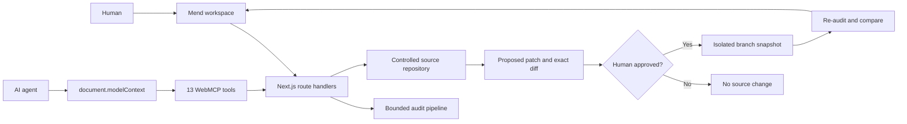

<div align="center">

# Mend

### Safe, verified website repairs through WebMCP

Mend turns a website audit into a shared human–agent workflow. An agent can
scan a site, inspect evidence, map findings to source, and prepare a patch. The
human reviews the exact diff before anything changes. Mend then applies the
approved repair to an isolated branch snapshot and verifies the result.

**Scan → Understand → Propose → Approve → Fix → Verify**

<p>
  <a href="https://mend-webmcp.vercel.app/"></a>
  <a href="https://devpost.com/software/mend-safe-verified-website-repairs-with-webmcp"></a>
  <a href="https://www.youtube.com/watch?v=yrF_mGdoVAY"></a>
</p>

<p>
  
  
  
  <a href="LICENSE"></a>
</p>

</div>


## The problem

Website audits are good at telling you what is wrong. Coding agents are good at
editing source. The difficult part is everything between those two moments:
finding the responsible file, deciding whether a proposed change is safe,
getting approval, and proving the repair actually improved the site.

Mend brings that disconnected workflow into one visible workspace:

| Stage | Agent contribution | Human control |
| --- | --- | --- |
| **Scan** | Runs bounded accessibility, performance, SEO, and link checks | Chooses the target site |
| **Understand** | Prioritizes findings and retrieves evidence | Sees the same issue context |
| **Propose** | Maps the issue to source and generates an exact diff | Reviews files, lines, and expected impact |
| **Approve** | Surfaces the patch for a decision | Explicitly approves or rejects it |
| **Fix** | Creates an isolated branch snapshot | Main remains unchanged |
| **Verify** | Re-runs checks and compares audits | Sees resolved issues and regressions |

## Why WebMCP

Mend is useful as a normal website, but WebMCP makes it agent-native. The
dashboard registers a small, coherent tool surface through
`document.modelContext`, allowing an agent to work with the same state the
human can see instead of guessing at buttons or depending on a separate hidden
integration.

WebMCP is the control plane for the complete repair story:



Tool-driven scans, proposals, approval requests, branch records, and
verification results immediately appear in the dashboard. Human actions in the
dashboard are visible to subsequent tool calls. Registration is feature
detected and tied to the React lifecycle with an `AbortController`, so Mend
still works in a normal browser and does not leave duplicate or stale tools
behind after navigation.

## Verified production result

The public build was re-verified on **August 31, 2026**:

| Check | Result |
| --- | --- |
| Production deployment | [HTTPS live site](https://mend-webmcp.vercel.app/) · HTTP 200 |
| WebMCP registration | 13 tools registered on the dashboard |
| Rendered mobile audit | Performance **98** · Accessibility **100** · SEO **100** |
| Repair verification | Accessibility **74 → 89** |
| Targeted result | **1 resolved** · **0 regressions** |
| Source safety | Approved branch snapshot created; checked-in `main` fixture unchanged |
| Browser health | No console errors during the complete production flow |

The rendered score is a point-in-time Lighthouse result and may vary slightly
between runs. The deterministic repair result is stable and requires no third-
party credentials.

## Try the complete demo

You can test the core story in about ninety seconds:

1. Open the [live Mend workspace](https://mend-webmcp.vercel.app/).
2. Choose **Try the deterministic demo workspace**, then **Scan site**.
3. Choose **Connect demo repo** and select the high-severity hero image issue.
4. Choose **Propose safe fix** and inspect the exact `Hero.tsx` diff.
5. Choose **Approve patch**, then **Apply approved patch**.
6. Confirm Mend creates a `mend/fix/...` branch record from `main`.
7. Choose **Verify branch snapshot** and confirm **74 → 89**, one resolved
   issue, and zero regressions.

No source content changes until **Apply approved patch**. Rejecting the patch
ends the workflow without a source mutation.

## WebMCP tools

The dashboard exposes these tools only when the browser provides the imperative
WebMCP API:

| Tool | Purpose | Read-only |
| --- | --- | :---: |
| `scan_site` | Run a new bounded audit | No¹ |
| `get_audit_summary` | Retrieve compact scores and high-impact counts | Yes |
| `list_issues` | Filter findings by category and severity | Yes |
| `inspect_issue` | Read evidence, impact, and source hints | Yes |
| `compare_audits` | Calculate resolved issues, regressions, and score deltas | Yes |
| `get_repository_status` | Inspect the connected repository identity | Yes |
| `list_repository_files` | List bounded source-file metadata | Yes |
| `inspect_source` | Read mapped source context for an issue | Yes |
| `propose_fix` | Generate a candidate patch without applying it | No¹ |
| `get_fix_diff` | Retrieve the exact proposed diff | Yes |
| `request_fix_approval` | Surface a patch for human review | No¹ |
| `apply_approved_fix` | Apply only a human-approved patch to a branch snapshot | No |
| `verify_fix` | Re-run checks against the applied snapshot | No¹ |

¹ These tools update Mend's workspace state but do not modify the target
website. `apply_approved_fix` is the only source-changing operation, and it
fails unless the server can verify explicit human approval.

Every tool uses a compact JSON schema, bounded output, meaningful error states,
and `untrustedContentHint`. Read-only tools declare `readOnlyHint: true`.

## Safety model

Mend treats scanned websites, audit evidence, and repository text as untrusted
input.

| Risk | Guardrail |
| --- | --- |
| SSRF and internal-network access | Blocks localhost, loopback, link-local, private IP ranges, private DNS results, and metadata-service targets |
| Unbounded scanning | Enforces fetch timeouts, redirect limits, response-size limits, and bounded resource probes |
| Prompt injection from page content | Never executes scanned code or lets page text redefine tool behavior |
| Unrelated source edits | Requires a verified issue-to-source mapping; unmapped findings cannot offer repair actions |
| Silent mutation | Shows the full original, proposed source, and unified diff before approval |
| Forged client approval | Uses short-lived signed HTTP-only approval and applied-state receipts |
| Direct changes to `main` | Applies only to an isolated controlled-demo branch snapshot |
| Secret exposure | Keeps repository access and provider credentials server-side |
| Regressions | Re-runs normalized checks and reports new findings explicitly |

## Audit pipeline

For any allowed public HTTPS URL, Mend performs bounded server-side analysis for:

- Missing or empty image alternative text
- Unlabeled form controls
- Heading hierarchy problems
- Render-blocking scripts
- Missing image dimensions and oversized image assets
- Missing metadata
- Broken same-origin links

When `MEND_PAGESPEED_ENABLED=true` and a PageSpeed API key is configured, Mend
adds rendered mobile Lighthouse performance, accessibility, and SEO results. If
that provider is disabled, unavailable, or rate-limited, the UI clearly reports
the fallback to static HTML analysis rather than presenting it as Lighthouse.

## Local development

### Requirements

- Node.js 20 or newer
- npm

### Start the app

```bash
git clone https://github.com/aryansk/mend-webmcp.git
cd mend-webmcp
npm ci
cp .env.example .env.local
npm run dev
```

Open [http://localhost:3000](http://localhost:3000). No environment variables
are required for the deterministic demo, static audit pipeline, or WebMCP tool
registration.

### Environment variables

| Variable | Required | Purpose |
| --- | :---: | --- |
| `NEXT_PUBLIC_APP_URL` | No | Canonical deployed application URL |
| `MEND_WORKSPACE_SECRET` | Production | Stable secret of at least 32 bytes for signed workspace receipts |
| `MEND_PAGESPEED_ENABLED` | No | Set to `true` to enable rendered PageSpeed enrichment |
| `PAGESPEED_API_KEY` | With PageSpeed | Server-side Google PageSpeed Insights key |
| `GITHUB_CLIENT_ID` / `GITHUB_CLIENT_SECRET` | Not currently used | Reserved for future GitHub OAuth |
| `GITHUB_APP_ID` / `GITHUB_PRIVATE_KEY` | Not currently used | Reserved for future GitHub App writes |
| `DATABASE_URL` | Not currently used | Reserved for durable multi-user persistence |
| `OPENAI_API_KEY` | Not currently used | Reserved for future model-generated patches |

Never commit `.env.local` or real credentials.

### Validation commands

| Command | What it checks |
| --- | --- |
| `npm run lint` | ESLint and Next.js rules |
| `npm run typecheck` | Strict TypeScript compilation without emitting files |
| `npm test` | Unit and integration tests with Vitest |
| `npm run test:e2e` | Chromium end-to-end workflow with Playwright |
| `npm run build` | Optimized Next.js production build |

Install the Playwright browser once before the E2E suite if it is not already
cached:

```bash
npx playwright install chromium
```

## How to test this submission

### Human UI

Follow the seven steps in [Try the complete demo](#try-the-complete-demo). Also
verify that an arbitrary rendered finding without a source hint shows **No
source match** and keeps both repair actions disabled.

### Agent flow

Open the dashboard in ChatGPT's in-app browser or in a WebMCP-enabled Chrome
build. For local Chrome testing, enable:

```text
chrome://flags/#enable-webmcp-testing
```

Then try this conversation:

> Scan the demo site and show me the highest-impact accessibility and
> performance issues.

> Inspect the hero image issue and propose a safe fix without changing the
> visual design or navigation. Do not apply it.

Review and approve the exact diff in Mend, then ask:

> Apply the fix I approved, verify it, and compare the before and after audits.

The expected tool sequence is:

```text
scan_site → get_audit_summary → list_issues → inspect_issue
          → inspect_source → propose_fix → get_fix_diff
          → request_fix_approval → [human approval]
          → apply_approved_fix → verify_fix → compare_audits
```

The app also works without WebMCP: manual scanning, source inspection, patch
review, approval, application, and verification remain available through the
human UI.

## Project structure

```text
app/
├── api/                    Audit, repository, fix, approval, and verify routes
├── dashboard/              Repair workspace route
└── page.tsx                Landing page
components/
├── dashboard-page.tsx      Shared human/agent workspace state
├── webmcp-bridge.tsx       WebMCP lifecycle integration
├── audit-overview.tsx      Scores and before/after verification
└── source-viewer.tsx       Read-only mapped source inspection
lib/
├── audit/                  Safe fetch, analyzers, PageSpeed, and comparison
├── webmcp/                 Schemas, registration, callbacks, and API client
├── repository/             Controlled repository and source mapping
├── fixes/                  Proposal, diff, approval, and branch snapshot logic
├── verification/           Patched-source replay and regression detection
└── workspace/              Browser persistence and signed receipts
demo-repo/                  Intentional issues for the deterministic story
tests/
├── unit/                   Domain and safety behavior
├── integration/            Route-level workflows
└── e2e/                    Full WebMCP and human-approval story
```

## Technology

- Next.js App Router and React
- TypeScript
- Tailwind CSS
- Cheerio for bounded HTML analysis
- Google PageSpeed Insights for optional rendered Lighthouse data
- Vitest for unit and integration tests
- Playwright for end-to-end browser tests
- Vercel for HTTPS production hosting

No model API is required for the submitted workflow. The hackathon integration
is WebMCP itself.

## Known limitations

- Source patching is intentionally limited to the checked-in controlled demo
  repository.
- Branches and commits are deterministic server-side snapshots, not remote
  GitHub branches or pull requests.
- Audit, fix, and verification stores are in memory; signed receipts and browser
  state recover the controlled single-user flow, but this is not shared durable
  persistence.
- Verification replays checks against the patched source snapshot instead of a
  deployed preview environment.
- Rendered audits depend on the optional PageSpeed provider and fall back to
  static analysis when it is unavailable.

These boundaries keep the demonstration reliable and make every write
reversible without overstating what happened externally.

## Challenge submission

- [Live application](https://mend-webmcp.vercel.app/)
- [Devpost project](https://devpost.com/software/mend-safe-verified-website-repairs-with-webmcp)
- [Public 2:15 demo video](https://www.youtube.com/watch?v=yrF_mGdoVAY)
- [Demo narration and artifact notes](./docs/DEMO-VIDEO.md)
- [Submission description and judge steps](./docs/DEVPOST-SUBMISSION.md)

## License

Mend is open source under the [MIT License](./LICENSE).
