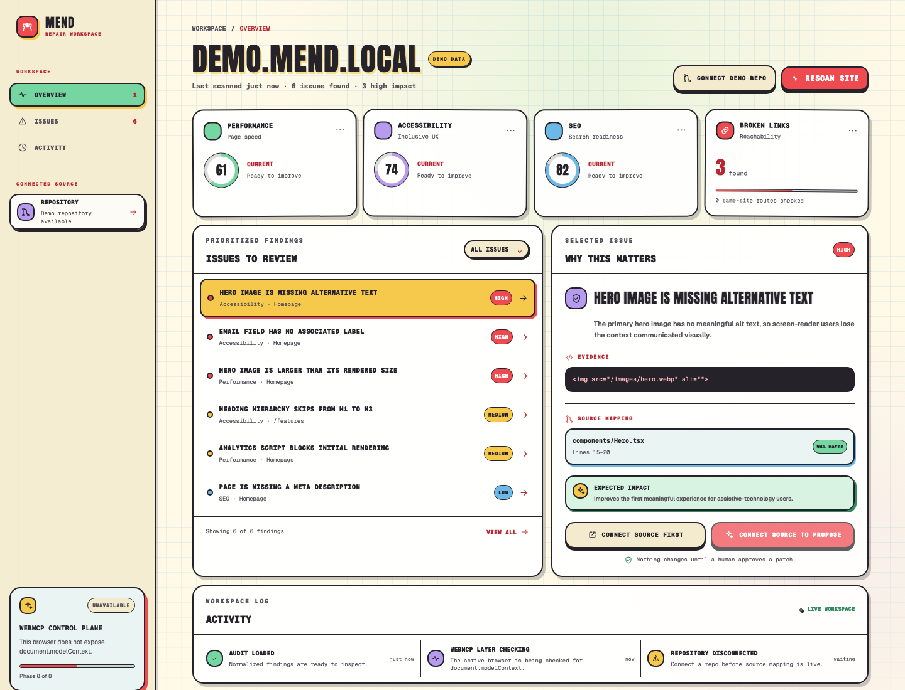

# Mend

Mend is an agent-native website repair workspace. It turns a website audit into
a shared human and agent workflow: scan, understand, propose, approve, fix, and
verify.

The project was submitted to the OpenAI WebMCP Challenge and is now being
hardened on a separate post-submission branch. The current local build has a
bounded server-side audit pipeline, optional rendered mobile Lighthouse results,
thirteen feature-detected WebMCP tools, a controlled repository source viewer,
an approval-gated branch snapshot flow, source-backed verification, reload-safe
browser workspace state, and signed server receipts for approval and apply
recovery. The controlled demo keeps its checked-in main fixture unchanged.

## Live demo

[Open Mend](https://mend-webmcp.vercel.app/)

Public source: [github.com/aryansk/mend-webmcp](https://github.com/aryansk/mend-webmcp)

The public URL runs the hardened build from `codex/post-submission-hardening`.
Its production WebMCP registration, direct tool execution, approval recovery,
apply, verification, and audit comparison were verified on August 27, 2026.

## Product preview



## Why Mend

Website owners have tools that report accessibility and performance issues, and
developers have tools that can edit source code. The difficult part is the
handoff between those systems. Mend keeps evidence, source hints, proposed
diffs, approval, and verification in one workspace.

WebMCP adds a structured agent control plane to the same human UI. An agent can
call compact tools to scan a site, retrieve a summary, filter issues, inspect
evidence, compare audits, read mapped source context, generate an exact diff,
and request human approval. After approval, the agent can create an isolated
branch snapshot without editing main, then replay verification against that
snapshot. Tool-triggered scans, fix proposals, branch records, and verification
results update the visible dashboard immediately, so the agent and human operate
on the same state. The human still approves every source-changing action.

## Architecture

```text
Human UI and active agent
          |
          v
document.modelContext  -->  WebMCP tool callbacks  -->  Next.js APIs
          |                                           |
          v                                           v
Dashboard state  <-----  audit / fix / verify stores  demo repository
                                      |
                                      v
                         branch snapshot and audit comparison
```

The browser and agent use the same route handlers and bounded domain models.
The controlled repository stays server-side, while the dashboard receives only
the source context, diff, branch metadata, and verification result needed for
human review.

## Current UI

- Landing page with URL validation and a deterministic demo entry point.
- Responsive audit dashboard with live performance, accessibility, SEO, and
  broken link score cards.
- Prioritized issue list with severity, category, page, evidence, and source
  confidence.
- Server-side HTML checks for missing alt text, unlabeled controls, heading
  hierarchy, blocking scripts, image dimensions, oversized image assets,
  metadata, and same-origin links.
- Optional
  [Google PageSpeed Insights v5](https://developers.google.com/speed/docs/insights/v5/reference/pagespeedapi/runpagespeed)
  enrichment for rendered mobile
  Lighthouse performance, accessibility, and SEO scores and failures. If it is
  disabled, unavailable, or rate-limited, Mend clearly falls back to the bounded
  static HTML audit.
- SSRF protections, redirect limits, response-size limits, fetch timeouts, and
  bounded resource probes.
- Deterministic patch generator for the controlled demo issues, with full
  original/proposed source and unified diffs.
- Patch review modal that records waiting, approved, and rejected states without
  mutating a repository.
- Branch-first apply action that verifies approval, validates the original
  source context, and records a demo branch and commit without changing main.
- Before/after verification against the actual patched source snapshot, with
  score deltas, resolved and remaining issues, regression checks, and saved
  audit IDs for comparison.
- Imperative WebMCP registration through `document.modelContext` with feature
  detection, abortable component lifecycle cleanup, and a visible registered
  tool status panel.
- Compact WebMCP responses backed by the same audit API as the human UI,
  including issue inspection and before/after comparison.
- Controlled demo repository connection with server-side file listing, safe
  relative-path validation, source-hint verification, and a read-only source
  viewer with highlighted mapped lines.
- Versioned browser workspace recovery plus signed HTTP-only approval/applied
  receipts, so a reload restores the controlled flow without trusting client
  state as source-mutation authority.
- Activity timeline, loading states, recoverable errors, accessible dialogs,
  and a focused full-screen mobile issue detail sheet.
- Native scrapbook visual system adapted from the Deal No Mercy iOS app, with
  paper surfaces, grid-paper backgrounds, sticker badges, hard shadows, and
  accessible high-contrast action states.

## Run locally

Requirements:

- Node.js 20 or newer
- npm

Install dependencies and start the development server:

    npm install
    npm run dev

Open http://localhost:3000, choose Try the deterministic demo workspace, and
select Scan site. On the dashboard, choose Connect demo repo, select an issue,
and choose Inspect source to open the checked-in source context. Choose Propose
safe fix, review the exact diff, approve it, and choose Apply approved patch to
create the isolated demo branch record. Then choose Verify branch snapshot to
show the deterministic before/after result. You can also enter a public HTTPS
URL to run the real server-side audit pipeline.

Validation commands:

    npm run lint
    npm run typecheck
    npm run test
    npm run test:e2e
    npm run build

## Project structure

    app/
      dashboard/page.tsx       Dashboard route
      error.tsx                Recoverable route error
      globals.css              Design tokens and responsive UI
      layout.tsx               Metadata and root layout
      page.tsx                 Landing route
    app/api/audits/
      route.ts                 Audit API for scans and stored summaries
    app/api/repositories/
      route.ts                 Controlled repository connection API
      files/route.ts            Safe file listing and reads
      source/route.ts           Issue-to-source resolution
    app/api/fixes/
      route.ts                 Deterministic proposal and diff API
      approval/route.ts          Human approval request API
      decision/route.ts          Explicit approve/reject API
      apply/route.ts             Branch-first approved-fix API
    app/api/verify/
      route.ts                 Controlled branch verification API
    components/
      audit-overview.tsx      Score cards and before/after verification
      dashboard-page.tsx       Interactive audit workspace
      icons.tsx                Small inline SVG icon set
      landing-page.tsx         Landing and demo entry point
      source-viewer.tsx        Read-only mapped source viewer
    docs/
      DEVPOST-SUBMISSION.md   Prepared submission copy and judge steps
      DEMO-VIDEO.md            Narration, metadata, and video artifact details
    public/
      mend-dashboard-preview.png  Product screenshot used in this README
    lib/
      audit/
        analyzers.ts           HTML issue normalization and score calculation
        fetch.ts               Bounded safe fetch and resource probing
        pagespeed.ts           Optional rendered mobile Lighthouse provider
        scanner.ts             Audit orchestration and demo handling
        summary.ts             Compact audit summary helpers
        store.ts               Lightweight in-memory audit store
        url-safety.ts          URL validation and SSRF protections
        compare.ts             Before/after issue and score comparison
      webmcp/
        api.ts                 Browser client for audit tool requests
        feature-detect.ts      document.modelContext detection
        register-tools.ts      Abortable tool registration lifecycle
        tool-schemas.ts        Compact JSON schemas and annotations
        tools.ts               Audit and repository tool implementations
        types.ts               Local WebMCP TypeScript contract
      fixes/
        apply.ts                Approval guard and branch snapshot store
        diff.ts                Bounded unified diff generation
        generator.ts           Controlled source patch plans
        service.ts             Proposal and approval state helpers
        store.ts               Lightweight in-memory fix store
        errors.ts              Fix validation errors
      verification/
        service.ts              Before/after source verification orchestration
        source-snapshot.ts      Checks against the patched source snapshot
      workspace/
        client-persistence.ts   Versioned reload-safe browser state
        receipts.ts             Signed approval and apply recovery receipts
      repository/
        demo.ts                Controlled repository definition
        files.ts               Bounded server-side file access
        mapping.ts             Issue-to-source validation
        store.ts               Lightweight connection store
        types.ts               Repository domain types
      demo-data.ts             Controlled demo audit
      types.ts                 Stable domain model
    demo-repo/
      ...                       Checked-in intentional issue source
    tests/unit/
      analyzers.test.ts        Fixture coverage for normalized findings
      summary.test.ts          Unit coverage for audit summaries
      url-safety.test.ts       Private-target and URL validation coverage
    tests/integration/
      audits-route.test.ts     API and category-filter coverage
      verify-route.test.ts     Apply-to-verify audit chain coverage

## WebMCP tool surface

The dashboard registers these tools with `document.modelContext` when the
browser exposes the imperative WebMCP API. `navigator.modelContext` is not
used. Registration is tied to the dashboard lifecycle with an `AbortController`
so stale tools are removed when the component unmounts.

- scan_site
- get_audit_summary
- list_issues
- inspect_issue
- compare_audits
- get_repository_status
- list_repository_files
- inspect_source
- propose_fix
- get_fix_diff
- request_fix_approval
- apply_approved_fix
- verify_fix

`scan_site`, `propose_fix`, `request_fix_approval`, `apply_approved_fix`, and
`verify_fix` update Mend workspace state, so they are explicitly annotated as
non-read-only. `apply_approved_fix` verifies both approval status and source
context before creating a controlled-demo branch snapshot; it never edits main.
`verify_fix` reads the patched branch source and reruns deterministic checks
against that snapshot, then returns saved before/after audit IDs for
`compare_audits`. The remaining tools
are read-only and return bounded JSON designed for agent reasoning. The
repository and fix tools expose only the connected demo repository and never
return credentials. GitHub OAuth, real remote commits, and pull requests remain
future integration work.

## Environment

The environment template is `.env.example`. No environment variables are
required for the bounded static audit, demo repository, or WebMCP tools.
Production reload recovery requires a stable `MEND_WORKSPACE_SECRET` with at
least 32 random bytes. Optional rendered scans require both
`MEND_PAGESPEED_ENABLED=true` and a `PAGESPEED_API_KEY`.

- NEXT_PUBLIC_APP_URL
- MEND_WORKSPACE_SECRET
- MEND_PAGESPEED_ENABLED
- PAGESPEED_API_KEY
- GITHUB_CLIENT_ID
- GITHUB_CLIENT_SECRET
- GITHUB_APP_ID
- GITHUB_PRIVATE_KEY
- DATABASE_URL
- OPENAI_API_KEY

Never commit real credentials.

## Safety model

Mend treats scanned pages and repository text as untrusted input. The audit
pipeline validates URLs, blocks private-network targets and DNS results,
manually validates redirects, bounds fetched content and resource probes, and
uses request timeouts. The repository connector permits only known demo files,
validates relative paths, bounds source reads, keeps all repository access on
the server, and returns no tokens to the browser. Future remote source writes
will require explicit human approval and preserve a reversible branch-based
change path. Verification inspects the actual patched demo source snapshot; it
does not claim that an external preview was deployed.

The browser persists a versioned copy of the visible controlled workspace.
Approval and applied-state recovery use short-lived signed HTTP-only receipts,
so local storage alone cannot authorize a source-changing action. Server stores
remain lightweight and in-memory, which is appropriate for the bounded demo but
is not multi-user production storage.

## How to test this hardening branch

1. Run `npm install`, then `npm run dev`, and open
   `http://localhost:3000/`.
2. Choose **Try the deterministic demo workspace**, then choose **Scan site**.
3. Choose **Connect demo repo** and select the high-severity hero image issue.
4. Choose **Propose safe fix**, review the exact diff, and choose **Approve
   patch**.
5. Choose **Apply approved patch**. Confirm the new `mend/fix/...` branch record
   appears and the checked-in `main` fixture remains unchanged.
6. Choose **Verify branch snapshot**. The expected result is **Fix verified**,
   accessibility **74 → 89**, one resolved issue, and zero regressions.
7. For the agent flow, use a browser with WebMCP enabled and ask the agent to
   scan the demo site, list the high-impact issues, propose a fix, and show the
   diff. Approve the patch in Mend before asking the agent to apply and verify
   it.

The controlled demo is deterministic, so the same steps can be repeated without
external credentials. The full tool-by-tool WebMCP checklist is below.

## WebMCP local testing

Use a WebMCP-capable browser. Chrome local testing requires the WebMCP testing
flag at:

    chrome://flags/#enable-webmcp-testing

Then:

1. Start Mend with `npm run dev`.
2. Open `http://localhost:3000/dashboard?site=https://demo.mend.local` in the
   WebMCP-enabled browser.
3. Confirm the dashboard status card changes from Checking to Ready and lists
   the thirteen registered tool names.
4. Ask the connected agent to call `scan_site` for `https://demo.mend.local`.
5. Use the returned `auditId` with `get_audit_summary` and `list_issues`.
6. Pass an issue ID from `list_issues` to `inspect_issue`.
7. Click Connect demo repo in Mend and verify the repository card shows
   `mend/demo-site` on `main`.
8. Ask the agent to call `get_repository_status`, `list_repository_files`, and
   `inspect_source` with `repo_demo_001` and an issue ID.
9. Ask the agent to call `propose_fix` with `repo_demo_001` and
   `issue_img_alt`, keeping the constraints about visual design and navigation.
10. Ask the agent to call `get_fix_diff`, then `request_fix_approval` with the
    returned fix ID.
11. Review the exact diff in Mend and click Approve patch or Reject patch.
    Confirm the activity log records the human decision.
12. After approval, click Apply approved patch or ask the agent to call
    `apply_approved_fix`. Confirm Mend shows a `mend/fix/...` branch, a commit
    record, and that main source still contains the original issue.
13. Click Verify branch snapshot or ask the agent to call `verify_fix`. Confirm
    the before/after panel shows the targeted issue resolved, score deltas, and
    zero regressions.
14. Pass the saved audit IDs to `compare_audits` and confirm the same result.
15. Reload after approval and confirm the proposal and approval-gated Apply
    action are restored before continuing.

Browsers without WebMCP still support manual scanning and issue inspection; the
status card reports that the agent control plane is unavailable. Any later
deployment must repeat the HTTPS preview and production WebMCP verification
sequence before it is called successful.

## Known limitations

- Source patch generation and branch snapshots are limited to the checked-in
  controlled demo repository.
- Server audit, fix, branch, and verification stores are still intentionally
  lightweight and in-memory. Browser state and signed receipts recover the
  controlled single-user flow across reloads, but this is not a shared database.
- Verification replays normalized checks against the approved branch snapshot;
  it does not deploy or fetch a real preview environment.
- Rendered audits depend on the optional Google PageSpeed API and automatically
  fall back to static HTML analysis when unavailable.
- GitHub OAuth, remote commits, and pull requests are not enabled. The app does
  not imply that its controlled branch snapshot is a remote GitHub branch.

## License

Mend is released under the MIT License. See LICENSE.
